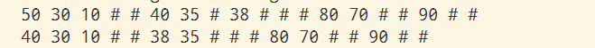

# 二叉搜索树

## 代码

```golang
package main

import "fmt"

type TreeNode struct {
	V int
	P *TreeNode
	L *TreeNode
	R *TreeNode
}

var NilNode = &TreeNode{}

type SearchTree struct {
	Root *TreeNode
}

func NewTreeNode() *TreeNode {
	return &TreeNode{
		P: NilNode,
		L: NilNode,
		R: NilNode,
	}
}

func NewSearchTree() *SearchTree {
	return &SearchTree{
		Root: NilNode,
	}
}

func (s *SearchTree) IsNilTree() bool {
	if s.Root == NilNode {
		return true
	}
	return false
}

func (s *SearchTree) addValue(node *TreeNode, e int) {
	if node == NilNode { // 这是一个根节点，根结点为空的
		N := NewTreeNode()
		N.V = e
		s.Root = N
		return
	}

	if node.V < e {
		if node.R == NilNode {
			N := NewTreeNode()
			N.V = e
			node.R = N
			N.P = node
		} else {
			s.addValue(node.R, e)
		}
	} else if node.V > e {
		if node.L == NilNode {
			N := NewTreeNode()
			N.V = e
			node.L = N
			N.P = node
		} else {
			s.addValue(node.L, e)
		}
	}
}

func (s *SearchTree) AddValue(e int) {
	s.addValue(s.Root, e)
}

func (s *SearchTree) findNode(node *TreeNode, e int) *TreeNode {
	if node == NilNode {
		return NilNode
	}

	if node.V < e {
		return s.findNode(node.R, e)
	} else if node.V > e {
		return s.findNode(node.L, e)
	}
	return node
}

func (s *SearchTree) FindNode(e int) *TreeNode {
	return s.findNode(s.Root, e)
}

func (s *SearchTree) FindPreNode(node *TreeNode) *TreeNode {
	if node.R != NilNode {
		return s.FindPreNode(node.R)
	} else {
		return node
	}
}

func (s *SearchTree) FindNextNode(node *TreeNode) *TreeNode {
	if node.L != NilNode {
		return s.FindNextNode(node.L)
	} else {
		return node
	}
}

func (s *SearchTree) SwitchLeafNode(node *TreeNode) *TreeNode {
	if node.L != NilNode {
		pNode := s.FindPreNode(node.L)
		node.V, pNode.V = pNode.V, node.V
		return s.SwitchLeafNode(pNode)
	} else if node.R != NilNode {
		pNode := s.FindNextNode(node.R)
		node.V, pNode.V = pNode.V, node.V
		return s.SwitchLeafNode(pNode)
	} else {
		return node
	}
}

// DelValue 删除某个节点，由于节点可能是内节点，内节点的处理有点复杂，
// 我的解决办法是，首先根据当前的节点的值，找到他的前驱或后继，然后交换数值，
// 持续这种算法，直至找到一个叶子节点。
// 找到叶子节点后，处理叶子节点就可以了。
func (s *SearchTree) DelValue(e int) {
	node := s.FindNode(e)
	if node == NilNode {
		return
	}
	leafNode := s.SwitchLeafNode(node)

	if leafNode == s.Root {
		s.Root = NilNode
	} else if leafNode != NilNode {
		pNode := leafNode.P
		if pNode.L == leafNode {
			pNode.L = NilNode
		} else {
			pNode.R = NilNode
		}
	}
}

func SearchTreePrint(node *TreeNode) {
	if node == NilNode {
		fmt.Print("# ")
		return
	}
	fmt.Print(node.V, " ")
	SearchTreePrint(node.L)
	SearchTreePrint(node.R)
}

func main() {
	ST := NewSearchTree()

	ST.AddValue(50)
	ST.AddValue(30)
	ST.AddValue(80)
	ST.AddValue(10)
	ST.AddValue(40)
	ST.AddValue(90)
	ST.AddValue(70)
	ST.AddValue(35)
	ST.AddValue(38)
	SearchTreePrint(ST.Root)
	fmt.Println("")
	ST.DelValue(50)
	SearchTreePrint(ST.Root)
	fmt.Println("")
}
```

## 输出



## 解析

树的用途很多，搜索树是一个常用的结构，很多语言都有类似的东西，有些语言采用的哈希查询表，他们针对的都是同一种问题，如何保存类似（K,V）的数据。

我以前做过尝试，虽然哈希表的理论算法是常量值，但是使用红黑树优化后，查找对应K的值，二者相差不大。这个证据也从某一个方面说明，算法的时间估计只是一个理论值，而且实际业务往往会有不同的需求，即便哈希是一个常量查询，可是优化后的红黑树也有可能完成这项任务。最终还是要看任务的要求，再决定使用何种结构。

二叉搜索树的定义很简单，左节点的值小于父节点的值，右节点的值大于父节点的值。

二叉搜索树还引出了另一个问题，树的线性化，也就是通过遍历的方式，从小到大打印树中的值。

由于树的线性化，引出另一个问题，节点的前驱节点和后驱节点。
