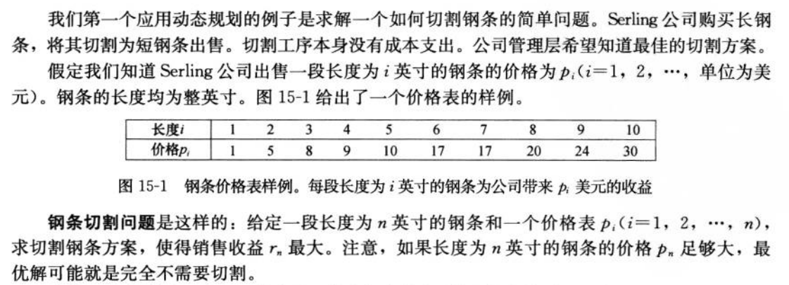

# 切割钢铁

## 代码

```golang
package main

import "fmt"

func cutRod(n int, P []int, T []int) int { // 自顶向下
	if T[n] > 0 { // 查表
		return T[n]
	}

	RMax := 0
	if n < len(P) {
		RMax = P[n]
	}
	for m := 1; m <= n/2; m++ { // 状态转换公式
		rmax := cutRod(m, P, T) + cutRod(n-m, P, T)
		if RMax < rmax {
			RMax = rmax
		}
	}
	T[n] = RMax

	return T[n]
}

func CutRod(n int, P []int) int {
	T := make([]int, n+1) // 临时表
	return cutRod(n, P, T)
}

func main() {
	P := []int{0, 1, 5, 8, 9, 10, 17, 17, 20, 24, 30}
	fmt.Println(CutRod(19, P))
	fmt.Println(CutRod(20, P))
}
```

## 解析

问题：

钢铁切割就是一个典型的N和（N-1, N-2, ... N/2）的关系。
