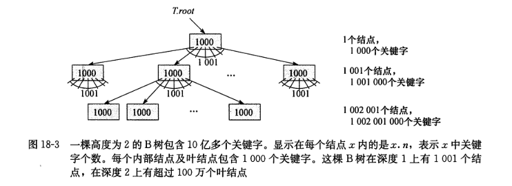

# B树

## 个人理解

高级数据结构部分，涉及的数据结构都是一些高级应用的时候会用到的，什么是高级应用，可以简单的理解成，高级应用就是最基础的部分，不能没有，但是实际用的情况少，你可能一直在使用它，但是，你不一定了解它，这就是高级应用。

学习数据结构，尤其是这种高级数据结构，往往很难理解它的运转过程，主要的一个原因是代码不是能够很好的模拟高级数据结构的操作。

我依据寻找“变”的法则，这个学习方法，来试试学习这些高级数据结构，尽量做到理解和应用层级。我相信，如果我能够学会者部分内容，会给我的信心增加不少。

## 简介

1. B树是一种平衡搜索树
2. B树是为磁盘或者其他直接存取的辅助设备设计的一种数据结构
3. B树类似红黑树，B树的优点是降低磁盘I/O操作树方面更好
4. B树存在不同的变种，用来应对一些数据库系统

## 分支因子

B树的结点可以有很多孩子，孩子的数量就是分支因子。

B树的分支因子可以相当的大。

## 数据存储过程

1. 定位
2. 读写

一般磁盘的定位速度慢，读写速度是电子化的，可以很快，所以磁盘一般采用块存储，这样，只要一次定位，就能写大量的数据，从而提高磁盘的读写速度。

## B树的内存处理方案

通常B树需要处理的数据量非常大，以至于所有数据无法一次装入主存。B树算法将所需页面从磁盘复制到主存，然后将修改过的页面写回磁盘。

任何时刻，B树算法都只需要在主存中保持一定数量的页面。

主存的大小并不能限制被处理的B树的大小。

简而言之，B树的内存处理方案就是一个局部数据对整体数据的一个应用。

所以对B树而言，一个典型的伪代码如下：

```txt
x = apointer to some object
DISK-READ(x)
operations that access and/or modify the attributes of x
DISK-WRITE(x)
other operations that access but do not modify attributes of x
```

从上面的伪代码中，我们看到DISK的操作是影响性能的关键，所以，一个B树的结点通常和一个完整的磁盘页一样大，并且磁盘页的大小限制了一个B树结点可以含有的孩子个数。



一个典型的例子如上面所示。

## B树的定义

一棵B树T具有以下性质的有根树（根为 T.root)

1. 每个结点x有下面属性：
   1. x.n 当前存储在结点x中的关键字个数。
   2. x.n 个关键字本事 x.key[1]， x.key[2]，...，x.key[x.n]，以非降序存放，使得x.key[1]<=x.key[2]<=...<=x.key[x.n]。
   3. x.leaf，一个布尔值，如果x是叶结点，则为TRUE，如果x是内部结点，则为FALSE。
2. 每个内部结点x还包含x.n+1个指向其孩子的指针x.c[1],x.c[2],...,x.C[x.n+1]。叶结点没有孩子，所以他们的C[i]属性没有定义。
3. 关键字x.key[i]对存储在各个子树中的关键字范围加以分割：如果k[i]为任意一个存储在以x.c[i]为根的子树中的关键字，那么k[1]<=x.key[1]<=k[2]<=x.key[2]<=...<=x.key[x.n]<=k[x.n+1]
4. 每个叶结点具有相同的深度，即树的高度h
5. 每个结点所包含的关键字个数有上界和下界。用一个被称为B树的最小度数的固定整数t>=2来表示这些界：
   1. 除了根结点以外的每个结点必须至少有t-1个关键字。因此，除了根结点以外的每个内部结点至少有t个孩子。如果树非空，根结点至少有一个关键字。
   2. 每个结点至多包含2t-1个关键字。因此，一个内部结点至多可有2t个孩子。当一个结点恰好有2t-1个关键字时，称该结点是满的。

B树的定义非常的复杂！！！

## B树上的基本操作

查找，创建和插入

约定：

1. B树的根结点始终在主存中，这样无需堆根做DISK-READ操作；然而，当根结点被改变后，需要对根结点做一次DISK-WRITE操作。。
2. 任何被当做参数的结点在被传递之前，都要对他们先做一次DISK-READ操作。

算法给出的过程都是“单程”算法，即它们从树的根开始向下，无回溯过程。

### 查找

B树查找和二叉搜索树的查找类似，无外乎二叉搜索树是两路分支选择，B树是进行多路选择，具体来说是进行（x.n+1）路选择。

(写算法前，一定要做分析，然后，考虑的是如何利用自己熟悉的语言进行代码组织)

x 表示当前结点，x 具有的已知信息有：

   1. x 中有 n 个关键字
   2. x 中有 n+1 个指向子结点的指针
   3. x 中的关键字个数已知
   4. x 中的关键字和给定的关键字可做比较运算
   5. x 是否是叶子结点

查找时可能的情况：

   1. 查找的关键字在 x 的结点中
   2. 查找的关键字可能在 x 的 n 个关键子的某个子区间，

```txt
B-TREE-SEARCH(x, k) {
   i := 0
   for ; i<x.n; i++ {
      if k <= x.key[i] {
         break
      }
   }

   if i<x.n && k == x.key[i] {
      return x, i
   }

   if x.leaf {
      return nil, 0
   }

   READ-DISK(x.c[i])
   return B-TREE-SEARCH(x.c[i], k)
}
```

### 创建

```txt
B-TREE-CRATE(T) {
   x := ALLOCATE-NODE()
   x.leaf = TRUE
   x.n = 0
   DISK-WRITE(x)
   T.root = x
}
```

### 插入

#### 分裂

分裂是树长高的惟一途径！！！

#### 根分裂

#### 非满根的插入

## 删除
