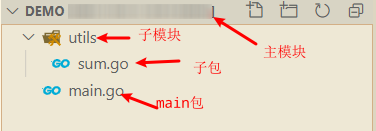

# 包和模块

## 简介

包和模块是软件的组织方式。

## 包

golang的所有文件都需要指定其所在的包。

### 规则

包的申明在golang文件的头部，申明关键字“package”。

“package main”是主包申明。

### 自定义包

这里有个反人类的设计，自定义包必须新建一个文件夹，这个新建的文件夹必须在程序文件夹下。

另外一个反人类的设计，某个文件夹下的所有go文件，只能属于同一个包（我去，设计人的脑子是不是坏掉了！！！）

具体的形式如下图：

## 模块

模块就是包含包文件的文件夹，概念上就是模块是包的集合。

主模块通常会有一个main包。

注意：模块名和包名可以不一致，但是通常不这样做，同一个模块下，只能有同一个包名，内嵌模块，可以使用一个新的包名。

重要的是，如果出现包名冲突，golang采用引用包重命名的语法规则用以修正这个问题。（都是反人类的设计，傻逼）
