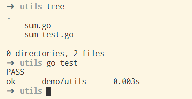

# 单元测试

## 简介

单元测试是一个基本的测试结构。

Go有一个内建的测试指令go test以及testing包。

性能测试和基于语句的测试。

测试覆盖率。

基准测试。

## 单元测试的组成元素

1. 单元测试的编写规则
2. 单元测试的运行方法

## 单元测试的编写规则

Golang的单元测试是内置的，为了更好的实施单元测试，Golang对单元测试编写制定了一些特殊的规则，依赖这些规则后，Golang可以更好的针对这些单元测试进行运行。

其次，为了更好的编写单元测试，Golang的制定的这些编写规则需要尽可能的简单。

规则描述如下：

1. 文件名规则：单元测试文件名必须为 XXX_test.go 的形式，其中XXX一般对应业务逻辑程序。
2. 函数名规则：单元测试的函数名必须为 TestXXX 的形式，其中XXX一般用于对应业务逻辑的函数名。
3. 参数规则：单元测试函数参数必须为 t *testing.T，这条规则有点反人类，这是testing框架要求的，至于原因，暂时不得而知。
4. 文件位置规则：测试程序和被测试程序文件需要在同一个package中，这条规则也很反人类，后期看看会不会引发其他的问题。

下面举一个例子：

1. 目录结构如下：

    ```txt
    ➜  demo tree
    .
    ├── main.go
    └── utils
        ├── sum.go
        └── sum_test.go

    1 directory, 3 files
    ```

2. main.go

    ```go
    package main

    import (
      "demo/utils"
      "fmt"
    )

    func main() {
      fmt.Println(utils.Sum(1, 2))
    }
    ```

3. sum.go

    ```go
    package utils

    // Sum 两个数的集合
    func Sum(x, y int) int {
      return x + y
    }
    ```

4. sum_test.go

    ```go
    package utils

    import "testing"

    func TestSum(t *testing.T) {
      cases := []struct {
        x int
        y int
        excepted int
      } {
        {1, 2, 3},
        {2, 2, 4},
      }

      for _, c := range cases {
        result := Sum(c.x, c.y)
        if result != c.excepted {
          t.Fatalf("Sum function failed, x: %d, y: %d, expected: %d, result: %d", c.x, c.y, c.excepted, result)
        }
      }
    }
    ```

## 测试函数的特性

1. 第一个也是唯一的参数必须是 t *testing.T
2. 函数名称以Test开头，紧接着以大写字母开头的单词或短语
3. 调用t.Error或者t.Fail来表示错误
4. t.Log可以用来提供无失败的调试信息
5. 测试代码必须保持在一个命名为something_test.go的文件中，例如：addition_test.go

## 测试表

"test tables"的概念是一系列测试输入和输出数值（切片数组）。

## 测试启动

go test，具体的使用方式如下图


