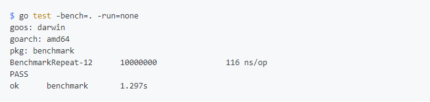

# 基准测试

## 简介

基准测试是一种测试代码性能的方法。

## Benchmark

golang 一般使用 Bechmark 用来做基准测试

## 操作步骤如下

1. 首先满足单元测试的基本结构
2. 不同的是基准测试需要以 Bechmark 开头，作为基准测试的函数名称，对应的函数参数类型是 *testing.B
3. 运行部分，优先运行单元测试，然后使用如下命令运行基准测试

    ```txt
    go test -bench=. -run=none
    ```

    其中，-bench=标记，这个接受一个表达式作为参数，匹配基准测试的函数，如果是“.”，表示运行所有基准测试。

    由于单元测试可能影响基准测试的运行结果，我们使用 -run=none 用来屏蔽单元测试的运行。

    一个网上的例子：

    

    对应的解释：

    下面着重解释下说出的结果，看到函数后面的-12了吗？这个表示运行时对应的 GOMAXPROCS 的值。接着的 10000000 表示运行 for 循环的次数，也就是调用被测试代码的次数，最后的 116 ns/op表示每次需要话费 116 纳秒。以上是测试时间默认是1秒，也就是1秒的时间，调用 10000000 次，每次调用花费 116 纳秒。如果想让测试运行的时间更长，可以通过 -lunchtime 指定，比如5秒。
