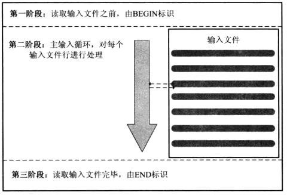

# 文本编辑系统

文本编辑系统是操作系统提供的一系列的文本命令行的编辑指令，这些指令各自完成各自的任务，主要的一个目的是为了实现非交互式的修改文本内容。其中比较重要的是sed命令和awk命令，这两个命令能够实现很多功能，其他命令多数是辅助作用。

## sed 命令

### 基础

sed命令使用的基本方式是，匹配-->操作-->输出，其中匹配可以是行的匹配，也可以是正则匹配，操作就是说一旦匹配成功，就执行响应的操作命令（增，删，改），输出就是在操作后，将内容输出到标准输出，并清空缓冲区，继续循环执行。

sed命令有一个有点，就是它可以实现非交互式的操作文本，经常有的一个操作就是，替换文本中某个模式的内容，但是，sed有一个明显的缺点，整体来说这个命令并不是很友好，一旦出现某个新的文本编辑需求，sed不能通过脚本形式进行添加，只能添加更多的子命令，同时，为了完成一些特殊需求，sed还提出了保持缓冲区的概念，这个概念虽然能够解决一些问题，但是依然不太友好，写出的命令一般也是晦涩难懂，主要的原因是保持缓冲区和原有的缓冲区（模式缓冲区）会有一些交互工作，比如交换，复制等等。在此，不对sed命令做过多的解释，主要原因是，我在实践过程中，发现awk的更灵活，更好用，而且写出的指令代码也更容易理解。为了对比这两个命令的差异，我这里举几个例子，用于对比。

### 逆序文件内容

a.txt文本内容:

  ```txt
  First
  Second
  Third
  ```

解：

  ```sh
  sed '1!G;h;$!d' a.txt
  ```

解释：

  1. 单引号中内容都是sed子命令操作
  2. 分号用于分隔多个命令
  3. 1!表示除了第一行不执行此命令操作
  4. $!表示除了最后一行不执行此命令操作
  5. G命令操作表示将保持缓冲区的内容追加到模式缓冲区中
  6. h命令操作表示将模式缓冲区的内容复制到保持缓冲区中
  7. d命令操作表示删除模式缓冲区中内容，执行下一个循环

如果你看完解释还是不能理解这个命令，你也不用费心去理解，因为awk处理这个更容易也更形象，这个命令的一个核心就是G和h的解释，简单的说G和h的操作导致生成了一个状态机器，这个状态机器始终保持文件的逆序内容，直到最后一行才输出，这个逆序内容的中间状态都是保存在保持缓冲区中。

### 将结构化的文件转换成表文件

b.txt的文件内容：

  ```txt
  table=t1
  name
  owner
  address
  table=t2
  id
  text
  col1
  comment
  col5
  table=t3
  prod_name
  price
  ```

输出结果：

  ```txt
  table=t1 name owner address
  table=t2 id text col1 comment col5
  table=t3 prod_name price
  ```

解：

  ```sh
  sed -n 'H;${g;s/\n/ /g;s/table/\ntable/g;p}' b.txt | sed -n '1!p'
  ```

解释：
  
  1. H命令操作将模式缓冲区的内容追加到保持缓冲区中
  2. g命令操作将保持缓冲区的内容复制到模式缓冲区中
  3. s命令操作就是替换操作
  4. p命令操作就是输出模式缓冲区的内容
  5. -n选项表示模式缓冲区的内容不输出到标准输出

是不是还是比较晕，没关系，学习awk后，再来看看这个问题。

### 打印行号

c.txt文件内容：

  ```txt
  a
  b
  c
  ```

输出结果：

  ```txt
  1 a
  2 b
  3 c
  ```

解：

  ```sh
  sed '=' c.txt | sed 'N;s/\n/ /'
  ```

解释：

  1. =命令操作输出行号
  2. N命令操作是往模式缓冲去多读入下一行内容

这其实是一个很简单的需求，但是sed实现起来就是不自然，为了显示行号还额外添加了=命令操作符，N的命令操作符就更令人费解了，个人感觉，就不该存在这样一个命令操作符，这不符合程序设计的基本要求，只会使得简单的问题变得更复杂。

通过以上三个例子的讲解，如果你能明白sed命令的使用方法更好，不明白，嗯，如果面试遇到了，算你倒霉，不明白其实对工作问题也不会产生大的影响，其中结构化文件的转换那个例子是个面试题，题目还特别强调只能使用sed，在这个信息化时代，尽然还有人出这样的题目，这种公司不去也罢。

## awk 命令

文本操作命令众多，如果你实在记不得所有指令，你也应该了解和深入掌握awk命令，awk命令准确的说应该是awk编程。它提供了对文本更友好的操作。

### 基本原理图



可能你会问，为什么我说即便你不能掌握sed命令也没关系，因为awk的模型设计从一开始就解决了sed的一个比较严重的问题，sed处理文本的时候没有办法定义变量！！！
awk从一开始的设计就不是设计成命令的形式，而是设计成了一种简易的编程语言的形式，awk有一个主循环，awk还定义了一些特定的变量，awk还能自定义变量，awk还拥有C语言的输出函数，这些都让文本处理变得更轻松。同样的，我还是已sed的三个例子作为表述，这里就直接提供解。

### 逆序文件内容

解：

  ```sh
  awk -v s="" '{s=$0"\n"s;}END{print s}' b.txt | sed -n '$!p'
  ```

解释：

  1. -v选项用来自定义变量，这里我定义了一个变量s
  2. $0是awk定义的一个变量，表示整行的内容
  3. $0"\n"s这个表达式是awk的字符串连接的写法
  4. END是awk的结构中最后的处理部分
  5. print是一个内置的命令

仔细对比sed的处理方法，你会发现这个命令更好懂，主要的原因是，状态保持的过程是显示的，也没有交换工程，只是字符串的连接操作。

### 将结构化的文件转换成表文件

解：

  ```sh
  awk -v s="" '/^table/{print s; s="";}{s=s" "$0}END{print s;}' b.txt | sed -n '1!p'
  ```

解释：

  1. /^table/是awk的模式匹配，匹配后执行{}中的内容

这个指令还是比sed的命令要简单的多，你可以仔细体会一下。

### 打印行号

解：

  ```sh
  awk '{print NR" "$0}' c.txt
  ```

解释：

  1. NR是awk内置变量，表示当前的行数

嗯，不用我多说了，你可以对比一下sed的命令格式。

### 小结

awk 是一个编程语言，主要分三部分，第一部分主循环，第二部分内置变量，第三部分内置命令和函数。如果你编程的时候遇到问题，百度这三个部分一定可以找到你想要的元素。

awk 还有一个非常重要的应用----编写一个动态脚本，然后由Shell执行。举个例子，将目录下所有的扩展名为.js的文件改成.ts的文件。

```sh
ls | awk '{tmp=$0;sub(/\.js$/, ".ts", $0);print "mv "tmp" "$0;}' | sh
```

sub是一个内置的替换函数，sh指令会执行awk生成的脚本，脚本内容就是mv相关的命令。

## sort 命令

sort命令就是给表文件进行排序的，所谓的表文件就是类似svc格式的文件，只是分隔符可能不是“，”，而是其他的符号，比如是“：”。

如果想对块结构文件进行排序的时候，我们的基本的思想就是将块文件转换成表文件，然后实施排序文件，最后在将表文件转换成块结构文件。举个例子。

### 更具姓名进行排序

d.txt文件内容：

  ```txt
  J Luo
  Southeast University
  Nanjing,China

  Y Zhang
  Victory University
  Melbourne, Australia

  D Hou
  Beijing University
  Beijing, China

  B Liu
  Shanghai Jiaotong University
  Shanghai, China

  C Lin
  University of Toronto
  Toronto, Canada
  ```

输出内容：

  ```sh
  B Liu
  Shanghai Jiaotong University
  Shanghai, China

  C Lin
  University of Toronto
  Toronto, Canada

  D Hou
  Beijing University
  Beijing, China

  J Luo
  Southeast University
  Nanjing,China

  Y Zhang
  Victory University
  Melbourne, Australia
  ```

解：

  ```sh
  cat d.txt | awk -v RS="" '{gsub("\n", "@") ;print}' | sort | awk -v ORS="\n\n" '{gsub("@", "\n");print}' | sed -n '$!p'
  ```

## uniq 命令

## join 命令

## cut 命令

## paste 命令

## split 命令

## tr 命令

## tar 命令

## grep 命令
