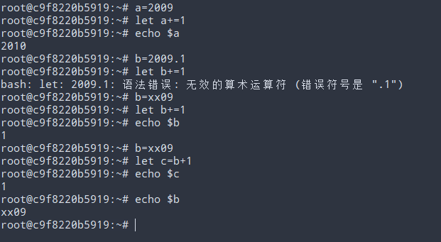

# 变量系统

## 简要说明

就整个Shell来说，Shell的变量都是无类型的，这句话的意思是，Shell的变量在某个时间点既可以是整型也可以是字符串型，至于是何种形态，要看上下文，目前来说，就是看表达式的意义。这点比较难理解。

还有一点，Shell总体来说是一个语言，Shell的每个执行语句，或者说某个子表达式都是有返回值的，这点需要有个清晰的认识，一旦有了这个意识，理解变量的赋值和替换就简单多了。

变量说穿了就是存某个值的地方，Shell没有类似C语言的变量地址这个概念，Shell从始至终都是字符串替换这个一个概念，某个字符串表达了什么意思，能否用东西替换掉？等等。有了这个意识理解变量的间接引用就水到渠成。

## 变量命名规则

## 变量基本操作符

变量的基本操作符是：“${...}”，其中“...”代表变量表达式，这是变量的基本操作符号，变量操作符是不支持嵌套操作的，简言之，如果想实现间接变量引用，仅仅通过变量操作符是不行的。

“!”操作符号是Shell的一个事件反显器，由于反显某个变量之前的赋值操作内容。

有了“!”操作符的功能，配合变量操作符就能得到间接变量的内容了。

## 变量类型判定

为了说明变量类型的判定，引入一个系统命令：let命令。

let 命令表示后面的字符串操作是一个算术操作，注意这里是独立Shell的变量系统的，所以变量的替换都不需要$符号。

简言之，凡是let命令操作的表达式都是算术操作，变量应该都是整数数字，所以这个可以做为变量类型判定的一个依据。

这里有个注意事项，如果变量代表的值不是一个整数，那么该变量做为算术操作时，初始化的值是多少？Shell规定，初始化的值是0。

## 变量的作用域

变量作用域是一个比较大的话题，目前来说，记住何处定义变量，何处就能使用这个概念。这个等后面说进程的时候，再来详细解释一下。

## 清除变量

unset 是用于将变量清除为未定义。

变量赋值语句有一个特殊的，现说明如下：

## 环境变量

系统定义的一些变量，或者自定义的一些变量，该变量可作用于所有的脚本，某种意义上可以理解成全局变量。

## 位置参数

命令行输入的时候需要引用命令行的参数，位置参数就是用来做这个的。

和位置参数有关的一个命令是：shift。

shift命令用于消费命令行参数，从而减少命令行参数，这个命令有一个非常好用的方式。

一个简单的测试如下：

