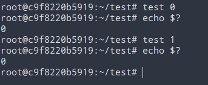

# 测试系统

## 简要说明

测试系统说法应该不准确，准确的说法是测试表达式，但是为了完整的看待Shell编程，我依然取名测试系统。

测试测试和结构化系统是搭配使用的，结构化系统主要是涉及结构化语句，比如分支语句，循环语句等等。

测试系统主要有三种表现形式：test，方括号和双圆括号。

其中 test 和 方括号 都是Shell结构，双圆括号是类C语言结构，具体用法如下。

## 表达式的状态

“?”变量是特殊变量，是位置参数变量的一种，“$?”表示命令的退出状态，0表示正常状态，其他为非法状态。

Shell中的表达式一共返回了两类值，一类是表达式自身的返回值，可以是空的，一类是表达式的退出状态，一般0表示正常，其他非正常，通常正常状态都是真值，其他都是假值，这个和C语言有很大不同，举个例子

从测试结果来看，不论test的是0还是1，最后的退出状态都是真（退出状态为0），这就是说，Shell的表达式的真假，不是看表达式的返回值，而是看表达式的退出状态，只要这个表达式能够正常运行，退出状态是0，那么此表达式为真！！！

简言之，Shell的表达式的运行结果通常是两个值，一个是返回值，一个是执行状态值。

有了这个基本认知，很多的表达式就方便理解了。

比如说比较运算符，比较运算符的表达式返回值都是空的，但是，比较运算符的执行状态值是有真假的。
算术运算符，算术运算符的表达式返回值一般都是算术表达式的值，通常算术运算符的执行状态值都是真的，异常运算为假。

## 整数比较运算符

-eq, -ge, -gt, -le, -lt, -ne

## 字符串运算符

string: 测试字符串不空
-n string: 测试字符串不空
-z string: 测试字符串空
string1 = string2: 测试字符串相等
string1 != string2: 测试字符串不等

## 文件操作符

-e file: 判断存在
-d file: 判断为目录
-f file: 判断为普通文件
-L file: 判断为符号文件
-s file: 判断文件长度不为0
-r file: 判断为进程可读
-w file: 判断文件进程可写
-x file: 判断为进程可执行

## 逻辑运算符

exp -a exp: 取与
exp -o exp: 取或
! exp: 取非
