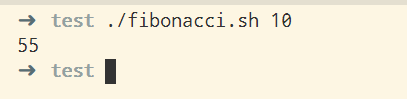

# 函数系统

## 简要说明

Shell的函数系统我的感觉就是比较鸡肋的东西，Shell的函数更准确的定义应该是简便的子命令系统。

Shell的函数可以理解成命令的集合，之所以不能等同于C语言，是因为，不论是参数输入还是函数返回值，Shell的函数都有限制。

Shell的函数输入只能使用位置参数，Shell的函数返回值，只能是函数的退出状态，类似命令的运行状态。

这两个方面的限制，就限制了函数的使用方式。

比如，虽然Shell支持函数的递归，但是，Shell并不能很好的支持分治算法等算法相关的内容。

对于函数的练习，可以从算法练习开始，其中递归的使用能更好的理解函数的运行轨迹。

## 函数名

## 函数参数

## 函数返回值

## 递归

## 例子

### 汉诺塔

汗诺塔问题是经典的递归问题，这里直接给出代码：

```sh
#!/bin/bash

hannuota() {  
  # 递归终止条件
  if [ $1 -eq 1 ];then
    echo "move $2------>$3"
    return
  fi

  # 递归规则
  hannuota "$(($1-1))" $2 $4 $3
  echo "move $2------>$3"
  hannuota "$(($1-1))" $4 $3 $2
}

hannuota $1 'A' 'B' 'C'
```

位置参数有个非常不好的点，就是代码的可读性非常的低，结合使用Shell的局部变量，会使得代码的可读性变好。

```sh
#!/bin/bash

hannuota() {  
  local hannuota_num=$1
  local cur_pillar=$2
  local dst_pillar=$3
  local aux_pillar=$4

  # 递归终止条件
  if [ $1 -eq 1 ];then
    echo "move $cur_pillar------>$dst_pillar"
    return
  fi

  # 递归规则
  hannuota "$(($hannuota_num-1))" $cur_pillar $aux_pillar $dst_pillar
  echo "move $cur_pillar------>$dst_pillar"
  hannuota "$(($hannuota_num-1))" $aux_pillar $dst_pillar $cur_pillar
}

hannuota_num=$1

hannuota $hannuota_num 'A' 'B' 'C'
```

解释：

  1. 函数外部定义的变量“hannuota_num”是一个全局变量，全局变量的意义就是不论哪个函数都能够使用。
  2. 函数内部定义变量，可以使用“local”关键字，标注这是一个函数内部的局部变量，这个变量只是在函数内部使用。

汗诺塔是一个很好的递归入门程序。

### 斐波那契数列

```sh
#!/bin/bash

fibonacci() {
  local n=$1
  if [ $n -eq 1 ];then
    echo 1
    return
  fi

  if [ $n -eq 2 ]; then
    echo 1
    return
  fi

  let sum=`fibonacci $(( $n - 2 ))`+`fibonacci $(( $n - 1 ))`
  echo $sum
}

fibonacci $1
```



解释：

  1. 由于Shell返回值的限制，这里使用了一个取巧的办法，不过这个办法不是万能的。
  2. Shell的返回值是可以返回的，不过只能是整数，这里其实可以直接使用return语句，我只是为了展示返回值的另一种可行的方式。
