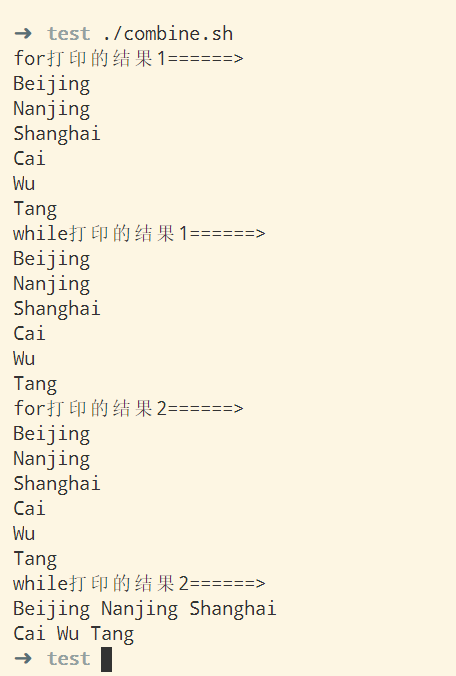

# 别名 列表 数组

## 简要说明

本文并不是要说明一个系统的概念，而是说明一些语言的其他优势。

## 别名

别名顾名思义就是给某个命令起一个其他的名字，或者某个过程起一个其他的名字，或者其他，最常见的一个别名就是“ll”，这个命令其实不是一个系统命令，它是“ls -l”的一个别名。

### 别名定义

alias

### 消除别名

unalias

## 列表

列表就是多组命令执行，列表有两大类，一类是与列表，一类是或列表。

列表和管道最大的不同点是，类表中命令都是各自独立的输入输出，管道中的命令输出都是下一个命令的输入。

与列表的执行规则：前面的指令若执行错误，那么后面的指令就不执行了。

或列表的执行规则：前面的指令若执行正确，那么后面的指令就不执行了。

列表状态返回值也是真和假，所以可以作为分支判定条件。

这里举一个例子，我们知道“du -sh *”可以获取本地文件夹下所有文件的大小，现在的问题，如果按照文件的大小逆向排序，查找占用空间最大的三个文件。

解：

  ```sh
  du -sh * >/tmp/1 && du -s * >/tmp/2 && paste /tmp/1 /tmp/2 | sort -k3 -rn | cut -f1,2 | sed -n '1,3p' ; rm -rf /tmp/2 ; rm -rf /tmp/1
  ```

解释：

  1. 这里我们使用了与列表和分句。
  2. 之所以使用与列表，是因为我们有多个输入和输出端，这点，无法单纯使用管道解决。

## 数组

Shell的数组和普通的数组的概念不太一样，但是，你依然可以把它当作数组看待。理解数组的概念以后，整个的Shell基本操作就算完成了，剩下的就是管道和进程的概念。

Shell利用数组的概念还可以实现一些基本的数据结构，比如栈等线性数据结构。对于类似树这种数据结构，Shell并没有很好的实现方式，主要的原因是，Shell通常处理的都是线性结构，但凡涉及到树，都是通过指令完成的，比如目录检索这种功能，简言之，当你需要这种功能的时候，你可以使用C语言或者其他脚本语言进行开发，生成指令，然后使用Shell进行应用。

### 定义

1. Shell的数组只能是一维的。
2. Shell变量的默认状态就是一个只有一个元素的一维数组。
3. 圆括号结构可以初始化数组。
4. 数组是可以隔断进行赋值的，但是底层的物理空间是连续的。
5. 数组的起始标号是0。
6. @和*是代表所有的数组标号，通过${array[@]}可以获得所有的数组元素，如果加上引号，可以获得所有已经赋值的数组元素。

### 数组连接

```sh
#!/bin/bash

city=(Beijing Nanjing Shanghai)
person=(Cai [5]=Wu Tang)

declare -a combine

combine=(${city[@]} ${person[@]})
echo "for打印的结果1======>"
for v in ${combine[@]}; do
  echo $v
done
echo "while打印的结果1======>"
count=${#combine[@]}
index=0
while [ $index -lt $count ]; do
  echo ${combine[$index]}
  ((index++))
done

unset combine
combine[0]=${city[@]}
combine[1]=${person[@]}
echo "for打印的结果2======>"
for v in ${combine[@]}; do
  echo $v
done
echo "while打印的结果2======>"
count=${#combine[@]}
index=0
while [ $index -lt $count ]; do
  echo ${combine[$index]}
  ((index++))
done
```

输出结果：



解释：

  1. 两种连接方式都行，但是会有细微的差别。
  2. 另外，不论那种方式，本来不连续的在连接后，都变成连续的，这个给数组的操作提供了某种可能。
  3. 数组的操作相比较其他语言并不是一个高效的操作，但是数组的操作给Shell带来了一定的灵活性。

### 栈

```sh
#!/bin/bash

MAXTOP=50

TOP=0
TEMP=
GTEMP=
declare -a STACK

get() {
  GTEMP=
  if [ $1 -lt 0 ]; then
    return
  fi
  GTEMP=${STACK[$1]}
  return
}

push() {
  if [ -z $1 ]; then
    return
  fi

  until [ $# -eq 0 ]; do
    STACK[$TOP]=$1
    let TOP=TOP+1
    shift
  done
  return
}

pop() {
  TEMP=

  if [ "$TOP" -eq 0 ]; then
    return
  fi

  let TOP=TOP-1
  TEMP=${STACK[$TOP]}
  unset STACK[$TOP]
  return
}

status() {
  echo "==================="
  echo "=======STACK======="
  for v in ${STACK[@]}; do
    echo $v
  done
  echo
  echo "Stack Pointer=$TOP"
  echo "Just popped \"$TEMP\" off the stack"
  echo "==================="
  echo
}
```

### 四则运算

```sh
#!/bin/bash

declare -a STACK

MAXTOP=50
TOP=$MAXTOP
TEMP=
GTEMP=

push() {
  if [ $TOP -le 0 ];then
    return
  fi
  let TOP=$TOP-1
  STACK[$TOP]=$1
  return
}

pop() {
  TEMP=
  if [ $TOP -ge $MAXTOP ]; then
    return
  fi
  TEMP=${STACK[$TOP]}
  unset STACK[$TOP]
  let TOP=$TOP+1
  return
}

status() {
  # 打印数组信息
  echo "=======>栈当前值"
  for v in ${STACK[@]}; do
    echo $v
  done
  echo "======>栈当前元素的个数："`echo "$MAXTOP-$TOP" | bc`
  return
}

get() {
  GTEMP=
  if [ $1 -ge $MAXTOP ]; then
    return
  fi
  let pos=$TOP+$1
  GTEMP=${STACK[$pos]}
}

op_plus() {
  local result=
  pop
  local opn2=$TEMP
  pop
  pop
  local opn1=$TEMP
  let result=$opn1+$opn2
  push $result
}

op_minus() {
  local result=
  pop
  local opn2=$TEMP
  pop
  pop
  local opn1=$TEMP
  let result=$opn1-$opn2
  push $result
}

op_multi() {
  local result=
  pop
  local opn2=$TEMP
  pop
  pop
  local opn1=$TEMP
  let result=$opn1*$opn2
  push $result
}

op_div() {
  local result=
  pop
  local opn2=$TEMP
  pop
  pop
  local opn1=$TEMP
  let result=$opn1/$opn2
  push $result
}

op_negative() {
  local result=
  pop
  local opn1=$TEMP
  pop
  let result=0-$opn1
  push $result
}

op_positive() {
  local result=
  pop
  local opn1=$TEMP
  pop
  let result=0+$opn1
  push $result  
}

op_bracket() {
  local result=
  pop
  pop
  result=$TEMP
  pop
  push $result
}

SYMBOL=
SYMBOL_RESULT=
is_left_bracket() {
  case $SYMBOL in
  '(')
  SYMBOL_RESULT=1
  ;;
  *)
  SYMBOL_RESULT=0
  ;;
  esac
}

is_multi() {
  case $SYMBOL in
  '*')
  SYMBOL_RESULT=1
  ;;
  *)
  SYMBOL_RESULT=0
  ;;
  esac
}

is_div() {
  case $SYMBOL in
  '/')
  SYMBOL_RESULT=1
  ;;
  *)
  SYMBOL_RESULT=0
  ;;
  esac  
}

is_plus() {
  case $SYMBOL in
  '+')
  SYMBOL_RESULT=1
  ;;
  *)
  SYMBOL_RESULT=0
  ;;
  esac  
}

is_minus() {
  case $SYMBOL in
  '-')
  SYMBOL_RESULT=1
  ;;
  *)
  SYMBOL_RESULT=0
  ;;
  esac

}

check_right_bracket() {
  get 0
  local v1=$GTEMP
  get 1
  local v2=$GTEMP
  get 2
  local v3=$GTEMP
  get 3
  local v4=$GTEMP

  SYMBOL=$v3
  is_plus
  if [ $SYMBOL_RESULT == 1 ]; then
    pop
    op_plus
    push $v1
    check_stack
    return
  fi

  SYMBOL=$v3
  is_minus
  if [ $SYMBOL_RESULT == 1 ]; then
    pop
    op_minus
    push $v1
    check_stack
    return
  fi

  SYMBOL=$v3
  is_left_bracket
  if [ $SYMBOL_RESULT == 1 ]; then
    op_bracket
    check_stack
    return
  fi

  return
}

check_num() {
  get 0
  local v1=$GTEMP
  get 1
  local v2=$GTEMP
  get 2
  local v3=$GTEMP
  get 3
  local v4=$GTEMP
  get 4
  local v5=$GTEMP

  SYMBOL=$v2
  is_multi
  if [ $SYMBOL_RESULT == 1 ]; then
    op_multi
    check_stack
    return
  fi

  SYMBOL=$v2
  is_div
  if [ $SYMBOL_RESULT == 1 ]; then
    op_div
    check_stack
    return
  fi

  SYMBOL=$v2
  is_minus
  if [ $SYMBOL_RESULT == 1 ]; then
    SYMBOL=$v3
    is_left_bracket
    if [ $SYMBOL_RESULT == 1 ]; then
      op_negative
      check_stack
      return
    fi
  fi

  SYMBOL=$v2
  is_plus
  if [ $SYMBOL_RESULT == 1 ]; then
    SYMBOL=$v3
    is_left_bracket
    if [ $SYMBOL_RESULT == 1 ]; then
      op_positive
      check_stack
      return
    fi
  fi

  SYMBOL=$v4
  is_plus
  if [ $SYMBOL_RESULT == 1 ]; then
    pop
    pop
    op_plus
    push $v2
    push $v1
    check_stack
    return
  fi

  SYMBOL=$v4
  is_minus
  if [ $SYMBOL_RESULT == 1 ]; then
    pop
    pop
    op_minus
    push $v2
    push $v1
    check_stack
    return
  fi

  return
}

check_stack() {
  # 输出头部元素，但是不出栈
  get 0
  case $GTEMP in
  '*');;
  '/');;
  '+');;
  '-');;
  '(');;
  ')')
  check_right_bracket
  ;;
  *) # 这里不处理特殊情况，凡是遇到*说明都是数字
  check_num
  ;;
  esac  
}

cal() {
  push '('
  while [ $# -gt 0 ]; do
    case $1 in
    \*)
    push '*'
    ;;
    *)
    push $1
    ;;
    esac
    check_stack
    shift
  done
  push ')'
  check_stack
  pop
  echo $TEMP
  return
}

cal 3 + 4 \* 3  # 15
cal 3 + 2 + 3 + 10 - 8 + \( 5 - 2 \) # 13
cal 10 - 8 + \( 5 - 2 \) # 5
cal 10 \* 8 - 20 / 2 # 70
cal 3 + 90 \* \( 9 - 5 \) / 3 - 23 # 100
cal - 10 + 5 # -5
cal 10 - \( + 10 - 5 \) # 5
```

四则运算这个算法，利用了栈，但是算法本身并不是说你理解了栈就能进行编写的。

四则运算这个算法有两个重要的部分，一个部分就是栈的可计算状态的不停转化，另一个就是符号运算，符号运算比较简单，就是弹出元素然后计算，算法的难点是栈的可计算状态的罗列。

栈的可计算状态参考“check_stack”的流程，目前只有两种状态，一个是栈顶元素是右括号，一个是栈顶元素是数字，这两种情况都有可能具备可计算状态，需要挨个检查。

这里还有一个就是，这里面还利用了符号优先级的概念，具体的，可以参看“check_num”函数的if语句的排列方式。

理解了四则运算的算法，就算是达到了一个算法的入门阶段，这个算法能够概括一系列类似的算法，状态转换。
